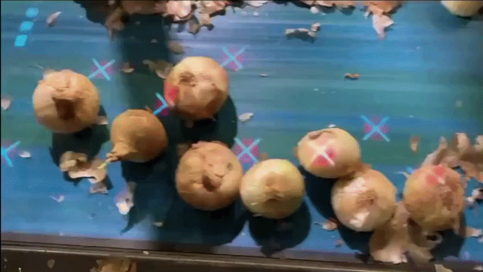

# AR-Based Onion Quality Inspection & Sorting System

## 🎥 Test Video

<p align="center">
  
</p>

This repository contains the code for an **Augmented Reality–based onion inspection system** developed by **Divyam Mehta** at the **THINC Lab, University of Georgia**.

The system:

- Tracks onions moving on a **high-speed conveyor** using fused data from **two standard webcams**.
- Uses a **YOLO-v8 model** (trained on 8000+ images) to detect onions and classify them as *good* or *blemished*.
- Uses a **custom slope- and/or velocity-based tracker** to estimate onion motion in real time.
- Projects **red (bad) or green (good) indicators** directly onto each onion using a **short-throw projector**, creating an AR overlay synchronized with the conveyor.

---

## ✨ Key Features

- **Dual-camera fusion** (anterior & posterior views).
- **YOLO-v8–based blemish detection** using a custom-trained model.
- **Multiple tracking backends**:
  - `VelocityTracker` (default, best for high-speed belts),
  - `SlopeTracker`,
  - `CentroidTracker`.
- **Real-time AR projection** using Pygame + short-throw projector.
- **Coordinate mapping** from camera pixels → real-world mm → projector pixels.
- **Automatic dataset logging** of good/bad onions for offline analysis.

---

## 📁 Project Structure

From the repository root:

```text
AR_Project/
└── THINC_code/
    ├── CentroidTracker.py       # Baseline centroid-only tracker
    ├── SlopeTracker.py          # Tracker using trajectory slope info
    ├── vel_tracker.py           # Velocity-based tracker (default)
    ├── deep_sort.py             # Optional tracker (in development)
    ├── iou.py                   # IoU utilities for overlapping detections
    ├── functions.py             # Sorting, DB operations, helper utilities
    ├── mapping.py               # Camera ↔ world ↔ projector mapping logic
    ├── vars.py                  # Global constants & configuration
    ├── onion.py                 # Onion-related data structures (if used)
    ├── test_yolo.py             # YOLO model sanity check script
    ├── rough.py                 # Experimental / sandbox code
    ├── bytetrack.yaml           # Tracker config (if using ByteTrack-style logic)
    ├── main.py                  # 🔥 Main runtime: detection + tracking + AR
```

---

## 🔁 Processing Pipeline

Steps:

Frame Capture
main.py opens two webcams:
- Anterior camera: onion entry side
- Posterior camera: onion exit side

Pre-processing
- Rotate frames (90° clockwise).
- Crop to conveyor area.
- Resize to a common resolution (RESIZE_RES from vars.py).

YOLO-v8 Detection
- Run inference on the fused frame.
- Filter detections by class and confidence.
- Remove overlapping onions using IoU checks (iou.py).

Tracking
- Pass bounding boxes to VelocityTracker (or other tracker).
- Maintain an objectID → centroid mapping.
- Print/log ID, centroid, and time difference between frames.

Classification & ID Association
- Match YOLO detections to tracker IDs using centroid proximity.
- Store final class (good/bad) in id_class[objectId].

Coordinate Mapping
- Convert camera pixel coordinates → world coordinates in mm (pixelToMM).
- Project world coordinates → projector pixel coordinates (mmToPixelProjector).

AR Projection
Use Pygame to draw:
- 🟢 Green circle for good onions.
- 🔴 Red circle + white cross for blemished onions.
- Mirror/flip the Pygame surface to align with projector.

Database & Sorting
Use functions like `anterior_check`, `posterior_check`, `good_or_bad`, and `sort()` from functions.py to:
- Detect when an onion passes anterior/posterior lines.
- Decide whether it’s good or bad.
- Save onion images into GOOD_ONION_DB and BAD_ONION_DB.

---

## 🧱 Hardware Setup & System Layout

- 2 × Standard Webcams (no industrial camera required).
- 1 × Short-Throw Projector aligned above the conveyor.
- Conveyor carrying onions in a roughly straight line under the field of view.

Layout Configuration
- Anterior camera: mounted so that onions are visible as they enter the field.
- Posterior camera: mounted near the exit of the projection area.
- Projector: calibrated to overlay Pygame’s display onto physical conveyor space.
